# 可转债多因子选券研究报告

### 0.1 主要结论

| 项目 | 口径 |
|---|---|
| 数据区间 | `2018-01-02` 至 `2024-12-26` |
| 研究样本 | `research_df`，剔除无成交、无换手、未进入转股期和剩余期限过短样本 |
| 最终因子 | `bond_prem + dblow + alpha_pct_chg_5` |
| 执行规则 | `amount q20` 过滤 + BW 双周 `Top10 / Top15` 缓冲 + 持仓内排名加权 |
| 正式成本 | `fee_rate = 0.002` |
| 基准 | 研究样本等权基准，不计手续费（基准作为因子零假设参照，不计手续费以便分离选券 alpha 与交易成本效应） |

把手续费提高到 **`fee_rate=0.002`** 后，策略收益会明显低于低费率情形，但没有失去正收益和超额收益。单因子分组、IC/IR、调仓频率、执行层对比和分阶段结果放在一起看，策略并不是只靠某一张图或某一组参数支撑；不过交易成本、权重集中度和市场阶段变化仍然会影响结果。

正式口径下，缓冲排名加权 BW 主策略**年化收益约为 `36.86%`**，**夏普约为 `1.7583`**，**最大回撤约为 `-18.25%`**，**平均换手约为 `0.1814`**。相对研究样本等权基准，策略**超额累计收益约为 `348.29%`**，**信息比率约为 `1.4356`**。虽然无缓冲 Top10 排名加权的全样本指标略高，但它同时改了换仓和权重两件事，所以没有把它直接写成最终方案。

## 1. 数据与样本过滤

### 1.1 样本背景

数据来自 `cb_data.pq`，时间范围是 `2018-01-02` 到 `2024-12-26`。全样本共有 `559,940` 行、`80` 列，`code + trade_date` 唯一。样本池扩张比较明显：2018 年初每天只有几十只可转债，后期稳定在 500 只左右，最高达到 `548` 只。后面解释因子稳定性、年度表现和滚动验证时，这个扩容背景不能忽略。

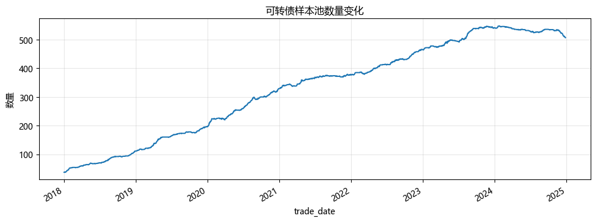

图 1  可转债样本池数量变化

注：样本池从 2018 年初的几十只逐步扩到后期 500 只以上，横截面结构本身发生了变化。

### 1.2 样本过滤与可交易性约束

研究样本先做基础清洗：要求存在成交额、存在换手、已经进入转股期，且剩余期限不能太短。进入策略构建时，再额外加入 **`amount` 日截面底部 20% 剔除**。这里的 `amount q20` 是可交易性约束，不作为 alpha 因子使用。

这一步不是为了把收益做高，而是为了让回测更接近真实可交易样本。另一个实验底稿里的 `full_df` 高收益结果没有沿用 `research_df` 过滤，只适合作为附录现象，不适合和正式口径混在一起。

## 2. 单因子分组与 IC/IR

### 2.1 检验口径

单因子部分先看一个问题：单个因子能不能在横截面上排出一些差异。这里保留两种观察方式：

- 分组回测：每天按横截面分成 5 组，`G1` 为低分组，`G5` 为高分组，`long_short = G5 - G1`。
- IC / RankIC / IR：衡量因子排序和未来收益排序的相关性。课程材料和研报中常把 **IC 大于 0.02** 作为相关性较显著的经验线，但仍要结合分组图和组合增量判断。

候选因子里，正文展示最终组合的 3 个核心因子：`dblow`、`bond_prem` 和 `alpha_pct_chg_5`。`turnover_5` 保留在附录。

### 2.2 dblow：双低因子

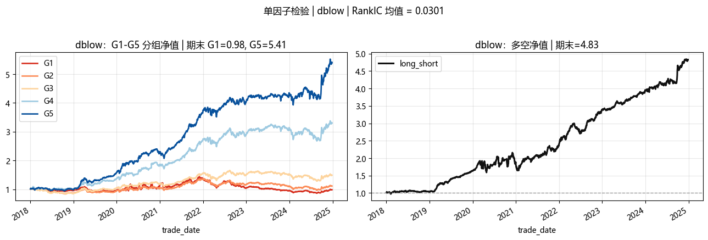

图 2  `dblow` 单因子检验

注：左图展示 `G1-G5` 五组净值，右图展示 `long_short`。在这批样本里，`dblow` 的图形分层更顺。

`dblow` 对应经典“双低策略”，同时考虑低价保护和低溢价弹性。它的 `IC 均值` 约为 `0.0208`，`RankIC 均值` 约为 `0.0301`，`RankICIR` 约为 `0.1699`。统计值不是最高，但分组图比较容易读出排序关系，所以我把它作为组合里的双低维度。

### 2.3 bond_prem：债底安全边际补充

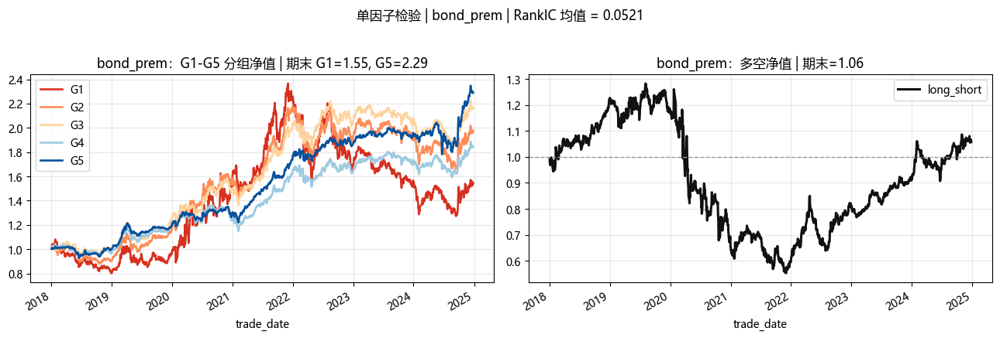

图 3  `bond_prem` 单因子检验

注：这张图适合保守解读为“期末 `G5` 高于 `G1`，且 `RankIC` 为正”。图形本身不支持把它写成长期单调分层很清楚。

`bond_prem` 的 `RankIC 均值` 约为 `0.0521`，在当前候选因子里最高；`RankICIR` 约为 `0.2056`。不过它的图形分层并不稳定，部分阶段 `G1` 和 `G5` 的相对表现会反复。因此我只把 `bond_prem` 定位为**债底安全边际补充**，不把它写成视觉证据最强的因子。

### 2.4 alpha_pct_chg_5：正股短期联动修正

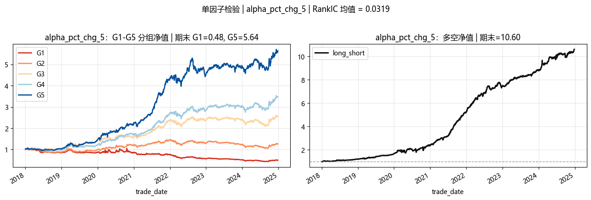

图 4  `alpha_pct_chg_5` 单因子检验

注：`alpha_pct_chg_5` 的单因子净值不是最强，但与估值类因子的相关性较低，可以补充正股短期联动信息。

`alpha_pct_chg_5` 在代码中按**低值更优**处理，即取负后进入综合评分。这个方向不应解释成“正股动量越高越好”，而更适合理解为正股短期联动/反转修正因子：近 5 日正股超额涨幅较低的转债，在当前样本下后续表现更好，可能反映短期追涨后的估值透支或涨幅相对滞后的补充信息。它的 `IC 均值` 约为 `0.0295`，`RankIC 均值` 约为 `0.0319`，`RankICIR` 约为 `0.2265`。这个因子不是靠单张分组图取胜，保留它主要是因为它能补上估值因子之外的正股短期联动信息。

### 2.5 因子统计汇总

| 因子 | IC 均值 | ICIR | RankIC 均值 | RankICIR | 组合定位 |
|---|---:|---:|---:|---:|---|
| `bond_prem` | `0.0185` | `0.0741` | `0.0521` | `0.2056` | 债底安全边际补充 |
| `alpha_pct_chg_5` | `0.0295` | `0.1867` | `0.0319` | `0.2265` | 正股短期联动/反转修正 |
| `dblow` | `0.0208` | `0.1185` | `0.0301` | `0.1699` | 双低策略维度 |
| `turnover_5` | `0.0166` | `0.0657` | `0.0305` | `0.1325` | 附录候选 |
| `theory_bias` | `0.0265` | `0.1365` | `0.0166` | `0.0862` | 与双低重复度较高 |

## 3. 多因子合成与相关性

### 3.1 合成方法

最终组合保留 `bond_prem + dblow + alpha_pct_chg_5`。每个因子先按日做截面去极值和 z-score 标准化，再按方向统一成 **分数越高越好**，最后等权平均为综合评分。

这 3 个因子的分工还算清楚：`dblow` 负责双低便宜度，`alpha_pct_chg_5` 负责正股短期联动/反转修正，`bond_prem` 作为债底安全边际补充。`turnover_5` 没有进入最终组合，原因是单因子图和统计证据不够一致；`theory_bias` 与 `dblow` 的替代关系更强。

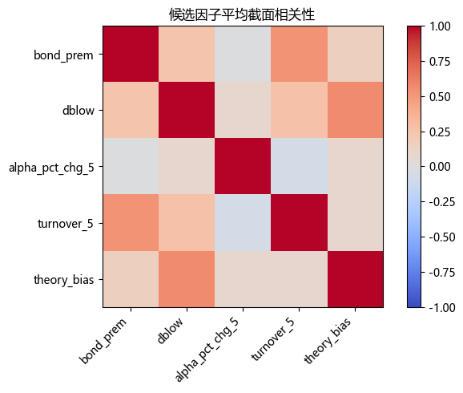

图 5  候选因子相关性热力图

注：`dblow` 与 `theory_bias` 的平均相关性约为 `0.566`，说明二者有较高重复度。`alpha_pct_chg_5` 与估值类因子相关性较低，适合作为补充信息。

### 3.2 组合敏感性比较

在双周调仓和正式费用口径下，3 个候选组合表现如下：

| 组合版本 | 年化收益 | 夏普 | 最大回撤 | 平均换手 | 超额累计收益 | 信息比率 |
|---|---:|---:|---:|---:|---:|---:|
| 四因子候选组合 | `17.75%` | `1.0912` | `-34.53%` | `0.1485` | `55.93%` | `0.6594` |
| 去掉 `turnover_5` | `26.85%` | `1.4328` | `-27.19%` | `0.1516` | `165.13%` | `1.1786` |
| 三因子组合 | `28.20%` | `1.4866` | `-18.15%` | `0.1693` | `184.30%` | `1.1966` |

这组对照里，三因子组合在收益、回撤和信息比率之间更均衡。因子层面先保留这个版本，后面再单独比较等权和排名加权。

## 4. 缓冲排名加权 BW 主策略

### 4.1 策略结构

主策略使用以下规则：

- 因子：`bond_prem + dblow + alpha_pct_chg_5`
- 可交易性约束：剔除 `amount` 日截面底部 20%
- 调仓：BW 双周检查一次组合
- 选券缓冲：`Top10` 买入，跌出 `Top15` 卖出
- 权重：最终持仓内按综合评分重新排序，若持仓数为 `m`，按 `m, m-1, ..., 1` 归一化分配权重
- 手续费：`fee_rate = 0.002`
- 基准：研究样本等权，不计手续费（基准作为因子零假设参照，不计手续费以便分离选券 alpha 与交易成本效应）

这套规则先用 `Top10 / Top15` 缓冲减少来回换仓，再用持仓内排名加权区分仓位强弱。无缓冲 Top10 排名加权仍然保留为对照，但不直接替代主策略，因为它同时改了换仓机制和权重机制。

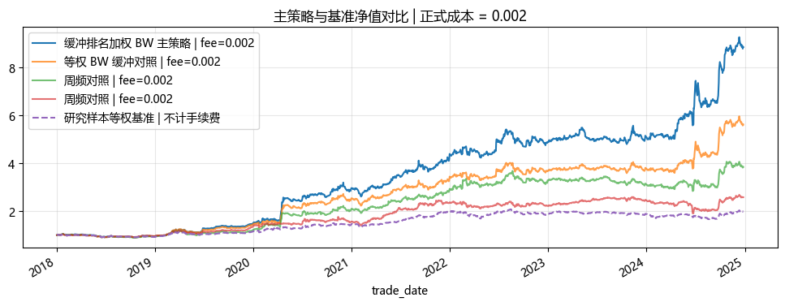

图 6  主策略与基准净值对比

注：图中主策略为缓冲排名加权 BW；等权 BW、周频和月频作为对照，均按 `fee_rate=0.002` 计入成本，基准不计手续费。

### 4.2 绩效指标

| 指标 | 缓冲排名加权 BW 主策略 | 等权 BW 对照 | 周频对照 | 月频对照 | 研究样本等权基准 |
|---|---:|---:|---:|---:|---:|
| 累计收益 | `785.66%` | `462.22%` | `285.34%` | `158.91%` | `99.93%` |
| 年化收益 | `36.86%` | `28.20%` | `21.42%` | `14.67%` | `10.48%` |
| 年化波动 | `20.96%` | `18.97%` | `18.72%` | `16.15%` | `12.26%` |
| 夏普 | `1.7583` | `1.4866` | `1.1441` | `0.9079` | `0.8551` |
| 最大回撤 | `-18.25%` | `-18.15%` | `-22.79%` | `-26.29%` | `-19.81%` |
| 平均换手 | `0.1814` | `0.1693` | `0.3275` | `0.0809` | - |

在这组样本里，缓冲排名加权比等权 BW 更能利用 Top10/Top15 内部的排序信息，最大回撤和换手也没有明显恶化。这里采用的是固定规则，不依赖动态阈值或事后择时。

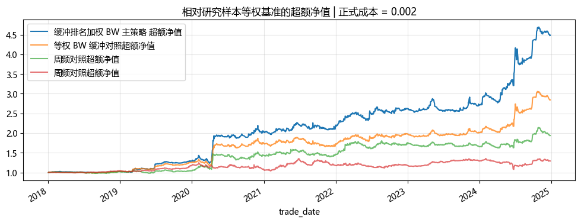

图 7  主策略超额净值

注：缓冲排名加权 BW 主策略相对基准的超额累计收益约为 `348.29%`，信息比率约为 `1.4356`。等权 BW 对照的超额累计收益约为 `184.30%`，信息比率约为 `1.1966`。

### 4.3 多空 20% 对冲验证

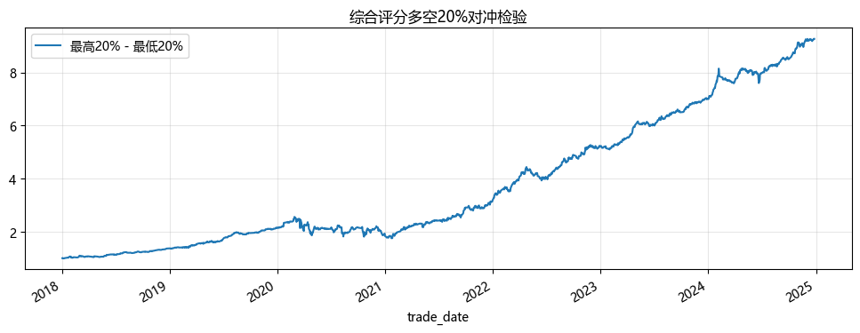

图 8  综合评分多空 20% 对冲净值

注：该图为每日最高 20% 组合减最低 20% 组合的等权多空验证，不计融资、融券和实际卖空约束。

多空 20% 对冲组合的年化收益约为 `37.75%`，夏普约为 `1.9350`，最大回撤约为 `-31.48%`。这个结果说明综合评分确实有一定横截面排序信息。但它不能直接当成实盘收益，因为做空低分转债、融资成本和冲击成本都没有纳入。

## 5. 稳健性分析

### 5.1 调仓频率敏感性

| 频率 | 年化收益 | 夏普 | 最大回撤 | 平均换手 | 超额累计收益 | IR |
|---|---:|---:|---:|---:|---:|---:|
| `D` | `-7.35%` | `-0.4255` | `-59.25%` | `0.7645` | `-70.68%` | `-1.3595` |
| `W` | `21.42%` | `1.1441` | `-22.79%` | `0.3275` | `93.89%` | `0.7742` |
| `BW` | `28.20%` | `1.4866` | `-18.15%` | `0.1693` | `184.30%` | `1.1966` |
| `M` | `14.67%` | `0.9079` | `-26.29%` | `0.0809` | `29.11%` | `0.3914` |

这一组只比较等权缓冲口径下的调仓频率。日频调仓换手太高，成本压力过大；月频虽然换手低，但信号衰减更明显。BW 双周相对折中，确定调仓周期后，再单独比较等权和排名加权。

### 5.2 TopN 敏感性

| 持仓数量 | 年化收益 | 夏普 | 最大回撤 | 超额累计收益 | 信息比率 |
|---|---:|---:|---:|---:|---:|
| `Top10` | `36.86%` | `1.7583` | `-18.25%` | `348.29%` | `1.4356` |
| `Top20` | `26.52%` | `1.5318` | `-17.03%` | `158.18%` | `1.2495` |
| `Top30` | `21.96%` | `1.4257` | `-16.06%` | `99.27%` | `1.1559` |

Top10 在样本里表现最好，说明强信号主要集中在前排。但这只是持仓集中度敏感性结果，不应继续拿来反复搜索参数。

### 5.3 手续费敏感性

| 手续费率 | 年化收益 | 夏普 | 最大回撤 | 平均换手 |
|---|---:|---:|---:|---:|
| `0` | `49.52%` | `2.3643` | `-16.68%` | `0.1814` |
| `0.001` | `43.06%` | `2.0564` | `-17.46%` | `0.1814` |
| `0.002` | `36.86%` | `1.7583` | `-18.25%` | `0.1814` |
| `0.003` | `30.92%` | `1.4708` | `-19.02%` | `0.1814` |

手续费对结果影响很大。缓冲排名加权的换手略高于等权 BW，但在 `fee=0.003` 下仍能保持正收益。真实交易里还要再看冲击成本和成交深度。

### 5.4 年度表现

| 年份 | 年化收益 | 夏普 | 最大回撤 | 平均换手 |
|---|---:|---:|---:|---:|
| 2018 | `-4.19%` | `-0.4816` | `-14.39%` | `0.1191` |
| 2019 | `56.47%` | `3.7811` | `-11.18%` | `0.1692` |
| 2020 | `98.77%` | `2.9653` | `-11.84%` | `0.1943` |
| 2021 | `48.19%` | `2.6729` | `-11.79%` | `0.2010` |
| 2022 | `11.52%` | `0.6013` | `-13.38%` | `0.1998` |
| 2023 | `5.01%` | `0.3824` | `-12.48%` | `0.1906` |
| 2024 | `74.19%` | `2.6233` | `-14.88%` | `0.1965` |

年度结果并不平滑。2018 年为负收益，2022 年和 2023 年的夏普明显回落，说明策略在不同市场阶段承受的压力不同。

### 5.5 分阶段表现

| 阶段 | 年化收益 | 夏普 | 最大回撤 | 平均换手 |
|---|---:|---:|---:|---:|
| `2018-2020` | `43.92%` | `2.0213` | `-14.39%` | `0.1609` |
| `2021-2022` | `28.59%` | `1.5369` | `-13.38%` | `0.2004` |
| `2023-2024` | `35.03%` | `1.5897` | `-14.88%` | `0.1935` |

分阶段结果都为正，但强弱差异很明显。`2023-2024` 阶段表现还可以，不过这不能推出未来也会稳定延续。

### 5.6 执行层对比

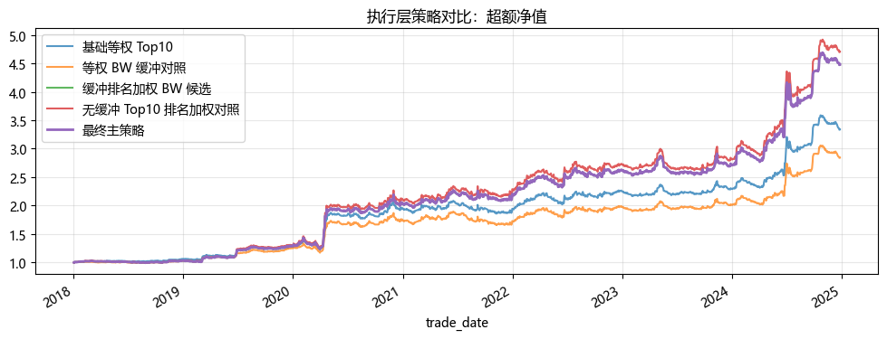

图 9  执行层独立测试对比

注：图中比较基础等权 Top10、等权 BW 缓冲、缓冲排名加权 BW、无缓冲 Top10 排名加权和最终主策略的超额净值。

| 策略 | 年化收益 | 夏普 | 最大回撤 | 平均换手 | 超额累计收益 | 信息比率 |
|---|---:|---:|---:|---:|---:|---:|
| 基础等权 Top10 对照 | `31.23%` | `1.6246` | `-17.97%` | `0.1807` | `233.95%` | `1.3255` |
| 等权 BW 缓冲对照 | `28.20%` | `1.4866` | `-18.15%` | `0.1693` | `184.30%` | `1.1966` |
| 缓冲排名加权 BW 候选 | `36.86%` | `1.7583` | `-18.25%` | `0.1814` | `348.29%` | `1.4356` |
| 无缓冲 Top10 排名加权对照 | `37.83%` | `1.7796` | `-18.19%` | `0.1847` | `370.71%` | `1.4486` |

无缓冲 Top10 排名加权的全样本指标略高，但它同时改变了换仓机制和权重机制。为了不把两个变化混在一起，正式主策略仍采用保留 `Top10 / Top15` 缓冲的排名加权版本。

### 5.7 可比口径参数网格

参数网格使用与等权 BW 频率选择一致的 `research_df`、`fill_method=None` 和正式回测函数，只改变 TopN、流动性过滤、调仓频率和手续费。它主要用来观察稳健性，不用来重新挑主参数。

在 `fee_rate=0.002` 下，等权缓冲口径年化收益前几组如下：

| 持仓数量 | 流动性过滤 | 调仓频率 | 年化收益 | 夏普 | 最大回撤 | IR |
|---:|---|---|---:|---:|---:|---:|
| 10 | `q40` | BW | `28.81%` | `1.5149` | `-18.40%` | `1.2305` |
| 10 | `q60` | BW | `28.43%` | `1.4152` | `-19.79%` | `1.1399` |
| 10 | `q20` | BW | `28.20%` | `1.4866` | `-18.15%` | `1.1966` |
| 10 | `q30` | BW | `27.56%` | `1.4543` | `-18.53%` | `1.1642` |
| 10 | `q50` | BW | `26.62%` | `1.3811` | `-17.75%` | `1.0862` |

更严格的流动性过滤在网格里略高，但也会缩窄样本。为了避免根据一次网格结果改口径，正式结果仍保留 `amount q20`。

### 5.8 滚动验证与执行阈值附录

固定滚动 3 年训练 + 1 年验证口径下，缓冲排名加权 BW 的拼接结果为：**年化收益约 `31.76%`**，**夏普约 `1.5587`**，**最大回撤约 `-14.88%`**，**超额累计收益约 `120.28%`**，**信息比率约 `1.3555`**。同口径下，等权 BW 对照年化约 `22.15%`，夏普约 `1.2085`，信息比率约 `1.0189`。缓冲排名加权在滚动验证里还能站住，但这组结果也提醒我，不能只看全样本净值。

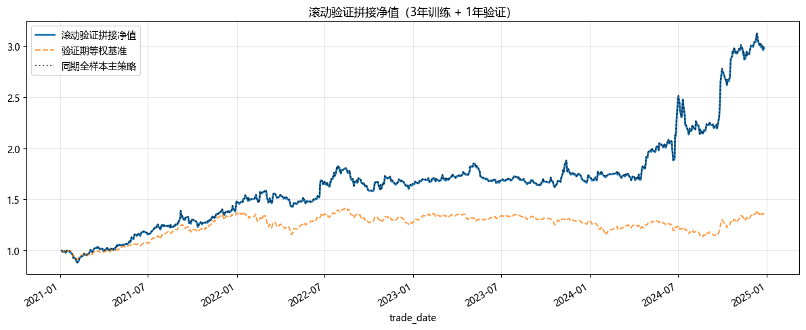

附图 A2  滚动验证拼接净值

注：每个验证年的净值归一化后拼接，黑色虚线为全样本主策略对照。2022 年验证期夏普明显回落，与分阶段结果一致。

| 验证年 | 训练期 | 选用策略 | 年化收益 | 夏普 | 最大回撤 | 平均换手 |
|---|---|---|---:|---:|---:|---:|
| 2021 | 2018-2020 | 缓冲排名加权 BW | `48.19%` | `2.6729` | `-11.79%` | `0.2010` |
| 2022 | 2019-2021 | 缓冲排名加权 BW | `11.52%` | `0.6013` | `-13.38%` | `0.1998` |
| 2023 | 2020-2022 | 缓冲排名加权 BW | `5.01%` | `0.3824` | `-12.48%` | `0.1906` |
| 2024 | 2021-2023 | 缓冲排名加权 BW | `74.19%` | `2.6233` | `-14.88%` | `0.1965` |

`trade_threshold=0.02` 只作为附录里的执行对照。动态 gap 阈值实验也一样：几个档位都有小幅改善，但差异不大，所以没有根据某一个 gap 档位改主策略。

## 6. 风险与局限性

1. **手续费风险**：手续费上升会明显压缩收益，缓冲排名加权换手略高于等权 BW，真实成本可能进一步压低结果。
2. **权重集中风险**：排名加权会提高头部持仓权重，如果头部评分失效，短期回撤可能放大。
3. **换手风险**：日频和周频调仓换手较高；BW 降低换手，但真实交易里仍可能有冲击成本。
4. **流动性风险**：`amount q20` 只能过滤成交额较低样本，不能完全解决小规模转债的成交冲击。
5. **条款与事件风险**：强赎、退市、信用事件、停牌和异常成交没有完全建模。
6. **正股风险**：正股暴跌会传导到转债价格，正股短期联动因子不能替代风控。
7. **回测陷阱**：参数网格、因子筛选、权重规则比较和全区间回测存在样本内优化风险。
8. **外推风险**：因子历史有效不代表未来稳定，尤其在市场扩容和交易制度变化后。

## 7. 结论

在这批样本里，`dblow`、`bond_prem` 和 `alpha_pct_chg_5` 的组合有清楚的经济解释，也能在分组、IC/IR、多空 20% 和组合回测中形成相互支持。正式成本 `fee_rate=0.002` 下，策略收益低于低费率情形，但仍保留正收益和正超额。

与日频、周频和月频相比，BW 双周调仓在当前正式口径下更好地平衡了信号有效期与交易成本。确定 BW 后，缓冲排名加权在手续费、年度、分阶段和滚动验证中都没有暴露出明显硬伤，因此作为最终主策略。

整体看，这个策略更适合作为一份研究作业里的完整样例：先看单因子分组和 IC/IR，再做多因子合成，最后用手续费、调仓频率、年度表现、执行层拆分和滚动验证反复检查。它还不是成熟实盘策略。

## 附录

### A.1 候选因子去留总表

| 因子 | 视觉证据 | 统计证据 | 定位 | 是否纳入 | 处理原因 |
|---|---|---|---|---|---|
| `bond_prem` | 期末 `G5` 高于 `G1`，但分层没有长期稳定压开 | `RankIC 均值 = 0.0521` | 债底安全边际补充 | 是 | 统计证据较强，但不作为图形主证据 |
| `dblow` | 分层更清楚，图形更顺 | `RankIC 均值 = 0.0301` | 双低策略维度 | 是 | 兼顾低价保护和低溢价弹性 |
| `alpha_pct_chg_5` | 单因子不是最强，但方向基本一致 | `RankIC 均值 = 0.0319` | 正股短期联动/反转修正 | 是 | 补充估值因子之外的信息 |
| `turnover_5` | 分组净值和 `long_short` 与统计结果不够一致 | `RankIC 均值 = 0.0305` | 行为候选因子 | 否 | 图形和统计证据没有同步支持 |
| `theory_bias` | 方向为正，但视觉区分度弱于 `dblow` | `RankIC 均值 = 0.0166` | 估值候选因子 | 否 | 与 `dblow` 重复度较高 |

### A.2 turnover_5 单因子补充图

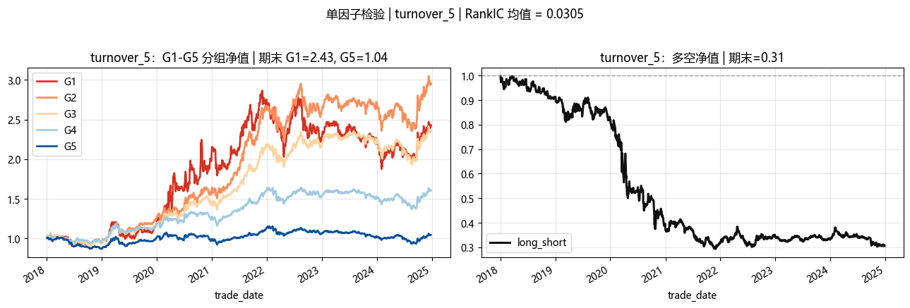

附图 A1  `turnover_5` 单因子检验

注：`turnover_5` 的 `RankIC 均值` 为正，但图形证据和统计证据不完全一致，因此没有进入最终组合。

### A.3 补充实验说明

补充实验底稿 `convertible_bond_factor_report_fee_robust.ipynb` 中，`full_df` 口径下的高收益结果没有沿用主报告的 `research_df` 样本过滤，因此不能纳入正式主结论。

其中的 `trade_threshold=0.02` 和动态 gap 实验只作为执行层探索。无缓冲 Top10 排名加权也只作为对照，因为它同时改变了缓冲机制和权重机制；正式主策略采用保留 `Top10 / Top15` 缓冲的排名加权版本。

### A.4 复现说明

研究底稿执行环境固定为：

```
D:\Anaconda\envs\QuantEnv\python.exe
```

主研究底稿：

```
notebooks/convertible_bond_factor_report.ipynb
```

报告导出脚本：

```
python report\build_report_docx.py
```

